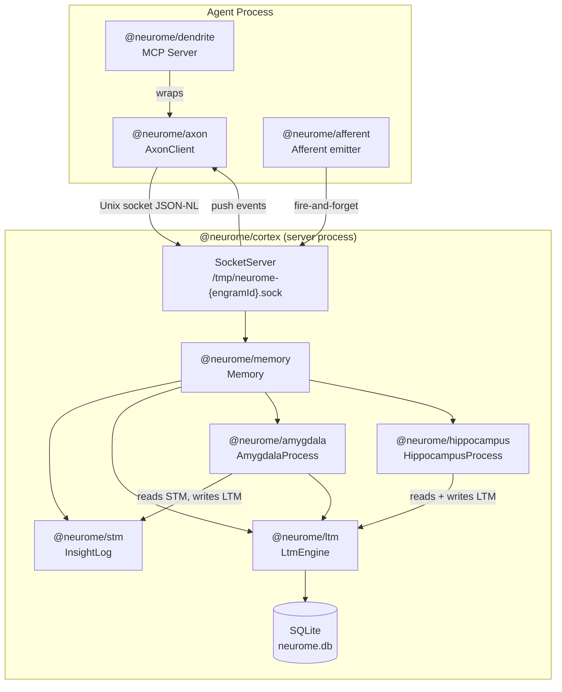
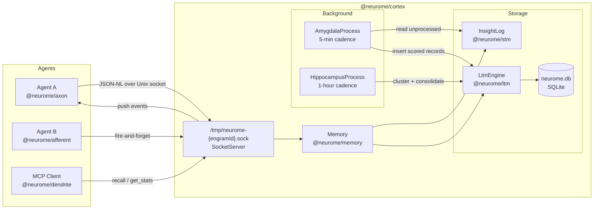
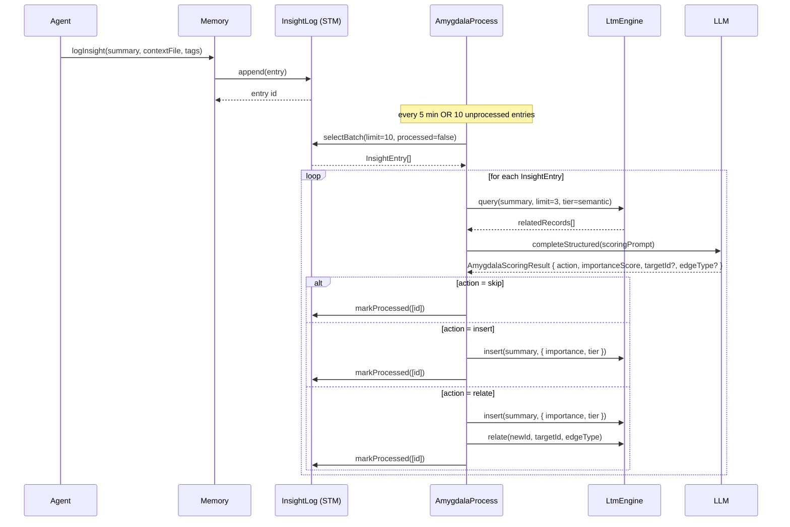
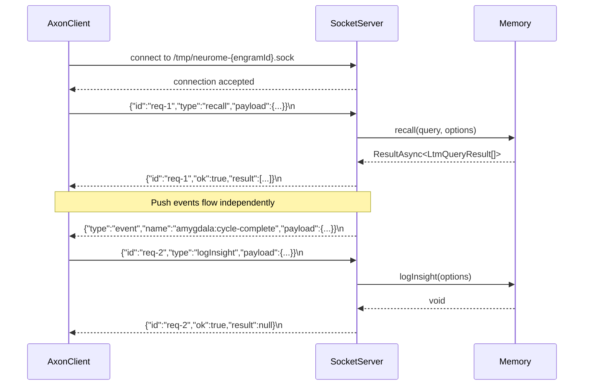
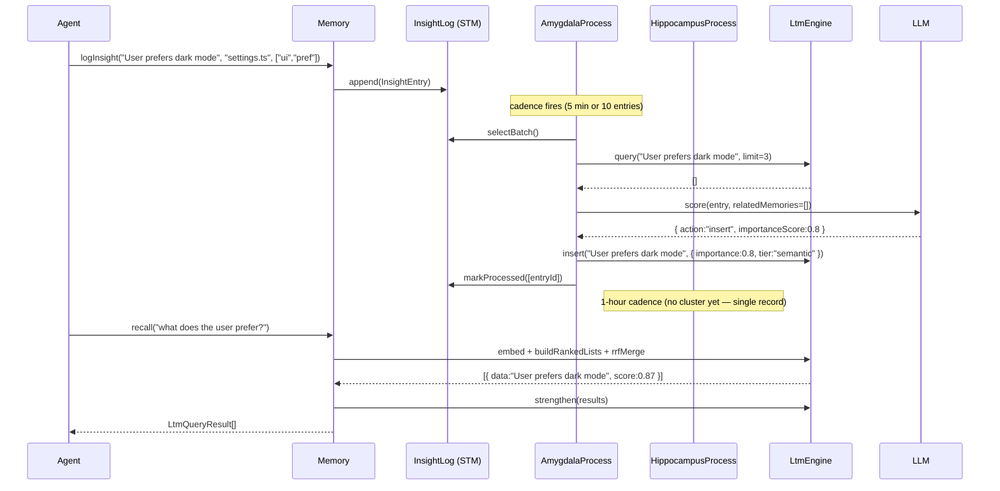

# Neurome System Specification

## Table of Contents

1. [Overview](#1-overview)
2. [Concepts & Terminology](#2-concepts--terminology)
3. [System Architecture](#3-system-architecture)
4. [Memory Lifecycle](#4-memory-lifecycle)
5. [SDK Integration Guide](#5-sdk-integration-guide)
6. [IPC Protocol Reference](#6-ipc-protocol-reference)
7. [MCP Tool Catalogue](#7-mcp-tool-catalogue)
8. [Agent Integration](#8-agent-integration)
9. [Running Cortex](#9-running-cortex)
10. [Package Internals Reference](#10-package-internals-reference)
11. [Error Catalogue](#11-error-catalogue)
12. [Configuration Reference](#12-configuration-reference)

---

## 1. Overview

Neurome (`@neurome/*`) is a biologically-inspired, persistent memory system for AI agents. It models the human cognitive memory system — working memory, short-term consolidation, long-term storage, and hippocampal integration — as a layered, autonomous pipeline that runs continuously alongside an agent process. By borrowing structure from neuroscience rather than from conventional database design, Neurome gives agents the ability to remember, forget gracefully, and discover relationships across accumulated observations over time. The current reference client is written in TypeScript, but the server exposes a language-agnostic IPC protocol over Unix domain sockets, allowing clients to be built in any language.

The biological analogy traces back to Vannevar Bush's 1945 vision of the Memex — a device that stores a person's books, records, and communications and is mechanised so it may be consulted with exceeding speed and flexibility. Neurome realises a software analogue of that vision: observations flow from an agent's working memory through a short-term buffer (`@neurome/stm`), are scored for importance by the amygdala process (`@neurome/amygdala`), consolidated into long-term records by the hippocampus process (`@neurome/hippocampus`), and stored durably in a vector-augmented SQLite database (`@neurome/ltm`). The orchestrating layer (`@neurome/memory`) wires these components together into a single cohesive runtime.

Neurome is deployed as a long-lived server process (`@neurome/cortex`) that agents communicate with over a Unix domain socket via the IPC client (`@neurome/axon`). The Model Context Protocol server (`@neurome/dendrite`) exposes memory operations as MCP tools. An optional terminal dashboard (`@neurome/neurome-tui`) provides real-time observability.

### Component Diagram



---

## 2. Concepts & Terminology

### Glossary

| Term                    | Definition                                                                                                                  |
| ----------------------- | --------------------------------------------------------------------------------------------------------------------------- |
| Working Memory          | Transient in-process state before `logInsight` is called                                                                    |
| STM (Short-Term Memory) | Volatile `InsightLog` buffer; entries await amygdala processing                                                             |
| LTM (Long-Term Memory)  | Durable vector-augmented SQLite store in `LtmEngine`                                                                        |
| Insight Entry           | Raw observation with `summary`, `contextFile`, `tags`, `timestamp`, `processed` flag                                        |
| LTM Record              | Persisted memory unit with embedding, importance, stability, tier, engramId                                                 |
| Episodic                | LTM tier for concrete time-anchored observations, subject to consolidation                                                  |
| Semantic                | LTM tier for abstract generalised knowledge, produced by consolidation or direct insert                                     |
| Procedural              | Out of scope; behavioural rules managed externally                                                                          |
| Amygdala                | Background process scoring STM entries via LLM                                                                              |
| Hippocampus             | Background consolidation process; episodic records are grouped into semantic memories                                       |
| Memory                  | Public orchestration façade over all subsystems                                                                             |
| Engram                  | Named scope partitioning LTM records (neuroscience: physical memory trace in the brain); matches `/^[\da-z][\w-]{0,127}$/i` |
| Stability               | Per-record scalar in days; initial value = `1 + importance × 9`                                                             |
| Retention               | `exp(-ageDays / stability)`; records with retention below 0.1 are pruned                                                    |
| Effective Score         | `cosine_similarity × retention`; governs recall ranking                                                                     |
| RRF                     | Reciprocal Rank Fusion — rank merge across semantic/temporal/associative lists with k=60                                    |
| Cortex                  | Server process that hosts `Memory` and handles IPC                                                                          |
| Axon                    | Unix socket IPC client (`@neurome/axon`)                                                                                    |
| Dendrite                | MCP server wrapping `AxonClient` (`@neurome/dendrite`)                                                                      |
| Afferent                | Fire-and-forget event emitter for agents (`@neurome/afferent`)                                                              |

### Biological Analogy Table

| Biological Term                                              | Software Concept                        | Package                |
| ------------------------------------------------------------ | --------------------------------------- | ---------------------- |
| Short-term / working memory buffer                           | `InsightLog` / `SqliteInsightLog` (STM) | `@neurome/stm`         |
| Amygdala — emotional/importance gating                       | `AmygdalaProcess`                       | `@neurome/amygdala`    |
| Hippocampus + neocortex storage                              | `LtmEngine` (LTM)                       | `@neurome/ltm`         |
| Hippocampal consolidation during sleep                       | `HippocampusProcess`                    | `@neurome/hippocampus` |
| Perirhinal cortex — entity recognition & relational encoding | `EntityExtractionProcess`               | `@neurome/perirhinal`  |
| Prefrontal cortex — executive orchestration                  | `Memory`                                | `@neurome/memory`      |
| Axon — long-range signal carrier                             | `AxonClient`                            | `@neurome/axon`        |
| Dendrite — receives signals from LLMs                        | MCP server                              | `@neurome/dendrite`    |
| Brainstem / neural substrate — always-on host                | Cortex process                          | `@neurome/cortex`      |
| Synaptic protocol                                            | IPC protocol                            | `@neurome/cortex-ipc`  |
| Afferent neuron — fire-and-forget                            | Afferent emitter                        | `@neurome/afferent`    |
| Cognitive processing layer                                   | LLM adapters                            | `@neurome/llm`         |

---

## 3. System Architecture

### Process Topology

The following diagram shows how agent processes interact with the Cortex server at runtime. Multiple agents can share a single Cortex instance by connecting to the same Unix socket.



### STM to LTM Promotion Sequence

This sequence shows how a single observation moves from an in-process log call through amygdala scoring and into durable long-term storage.



### IPC Request/Response Lifecycle

This sequence shows the full round-trip of an IPC request from client to Cortex and back, including the push event channel.



---

## 4. Memory Lifecycle

The memory lifecycle describes the complete journey of a single observation — from the moment an agent calls `logInsight` to the point where that observation can be recalled, reinforced, and eventually consolidated or pruned.

### Ingestion

When an agent emits an observation, it calls `Memory.logInsight()` with a natural-language summary, an optional path to a context file, and an optional set of tags. The `Memory` façade immediately appends the observation as an `InsightEntry` to the `InsightLog` (STM) buffer. This call is fire-and-forget from the agent's perspective — control returns immediately with no blocking LLM call.

The STM is a volatile, ordered queue. Entries wait there, marked as unprocessed, until the `AmygdalaProcess` picks them up.

### Amygdala Scoring

The `AmygdalaProcess` runs on a configurable cadence (default 5 minutes) and also triggers early if the STM accumulates 10 or more unprocessed entries. On each cycle the process:

1. Pulls a batch of up to 10 unprocessed entries from STM.
2. For each entry, performs a semantic search against LTM to retrieve up to 3 related memories.
3. Optionally reads up to 200 characters from the associated context file (skipped in low-cost mode).
4. Invokes the LLM with a structured scoring prompt that incorporates the summary, related memories, and context excerpt.
5. Applies the returned action:
   - `skip` — marks the entry processed without writing to LTM.
   - `insert` — inserts a new LTM record; if `importanceScore >= 0.7`, the record is promoted directly to the `semantic` tier.
   - `relate` — inserts a new LTM record and also creates a typed edge to an existing target record (e.g. `supersedes`, `elaborates`, `contradicts`).

The process tracks LLM call volume. When calls exceed 150 per hour it enters low-cost mode (no context file, one related memory). At 200 calls per hour the cycle halts entirely for that hour. Three consecutive failures tag an entry `permanently_skipped` rather than retrying indefinitely.

### Hippocampal Consolidation

The `HippocampusProcess` runs on a separate, slower cadence (default 1 hour). It clusters episodic records by semantic similarity (cosine >= 0.85) and temporal proximity (spread <= 30 days), using only records that have been accessed at least twice and where the cluster contains at least 3 members.

For each qualifying cluster, the process invokes the LLM to produce a consolidated summary. If the model's confidence falls below 0.5, the result is flagged as a potential false memory, stored as a `PendingConsolidation` (TTL 24 hours), and an event is emitted so the operator can review and approve or discard manually. Confident consolidations are inserted as new `semantic` tier records, source episodics are tombstoned, and context files are deleted.

After consolidation, the process calls `prune(minRetention=0.1)`, which removes any records whose retention score has decayed below the threshold.

### Recall

When an agent calls `Memory.recall(nlQuery, options)`, the query string is embedded into a vector. Three ranked lists are then assembled in parallel:

- Semantic ranked: cosine similarity descending.
- Temporal ranked: `cosine × retention` descending, favouring recent and durable memories.
- Associative ranked: graph traversal starting from the top-10 semantic hits, following typed edges.

RRF (k=60) merges these three lists into a single ranked result. Each candidate's effective score (`cosine × retention`) is computed, and candidates below the threshold (default 0.5) are dropped. If `minResults` is set and fewer results survive the threshold filter, the top-up mechanism supplements the result set with the next-best candidates regardless of threshold. Records that appear in the final result set have their stability strengthened proportional to their RRF rank and their retention at retrieval time.

Context boosting applies additional score bumps: +0.15 for records in the same engram, +0.10 for records with a matching category, capped at 1.0 total.

### End-to-End Sequence



---

## 5. SDK Integration Guide

> **Audience:** SDK consumers

`@neurome/sdk` is the single published entry point. It spawns cortex as a managed child process, connects an IPC client, and returns an `Engram` handle for all memory operations.

### Installation

```bash
npm install @neurome/sdk
```

### Starting an Engram

`startEngram` is the primary entry point. It opens (or forks) the SQLite database, spawns cortex, and connects automatically.

```typescript
import { startEngram } from '@neurome/sdk';

const engram = await startEngram({
  engramId: 'my-agent',
  db: '/var/data/my-agent.db',
  anthropicApiKey: process.env.ANTHROPIC_API_KEY,
  openaiApiKey: process.env.OPENAI_API_KEY,
});
```

#### `StartEngramConfig`

| Field             | Required | Default                 | Description                                      |
| ----------------- | -------- | ----------------------- | ------------------------------------------------ |
| `engramId`        | Yes      | —                       | Unique identifier for this engram                |
| `db`              | Yes      | —                       | Path to the SQLite database file                 |
| `source`          | No       | —                       | If set, forks `source` into `db` before starting |
| `anthropicApiKey` | No       | `ANTHROPIC_API_KEY` env | Anthropic Claude API key                         |
| `openaiApiKey`    | No       | `OPENAI_API_KEY` env    | OpenAI API key for embeddings                    |

### Logging an Insight

`logInsight` is non-blocking. It returns `void` immediately after appending to STM.

```typescript
engram.logInsight({
  summary: 'The user prefers dark mode across all interfaces.',
  contextFile: '/workspace/settings.ts',
  tags: ['ui', 'preference'],
});
```

Tags are stored alongside the record and propagated to LTM once the amygdala processes the entry. The `contextFile` path is read (up to 200 chars) by the amygdala during scoring to provide grounding context to the LLM.

### Recalling Memories

```typescript
const results = await engram.recall('what does the user prefer?', {
  limit: 5,
  threshold: 0.5,
});
```

Pass `minResults: 1` to guarantee at least one result even when nothing exceeds the threshold. Use `tier: 'semantic'` to restrict results to consolidated, generalised knowledge.

### Inserting a Memory Directly

Use `insertMemory` to write a record to LTM without going through the amygdala. This is appropriate for seeding knowledge at startup or importing structured facts.

```typescript
const id = await engram.insertMemory('The payment service runs on port 3001.', {
  importance: 0.9,
  tier: 'semantic',
  category: 'infrastructure',
});
```

### Forking for Parallel Agents

`fork` creates an atomic SQLite snapshot (via `VACUUM INTO` / `db.backup()`) for parallel agent runs. There is no write-back — the caller manages the fork lifecycle.

```typescript
const forkPath = await engram.fork('/tmp/fork-agent.db');
const forkEngram = await startEngram({ engramId: 'fork-agent', db: forkPath });
```

You can also fork at startup using the `source` config:

```typescript
const engram = await startEngram({
  engramId: 'fork-agent',
  db: '/tmp/fork-agent.db',
  source: '/var/data/original.db',
});
```

### MCP Integration

`asMcpServer()` returns the MCP server config pointing to the bundled dendrite script. Pass it directly to the Claude Agent SDK or any MCP client.

```typescript
const mcpConfig = engram.asMcpServer();
// => { type: 'stdio', command: 'node', args: ['/path/to/sdk/dist/bin/dendrite.js'], env: { NEUROME_ENGRAM_ID: '...', MEMORY_DB_PATH: '...' } }
```

### `Engram` Methods

| Method                      | Returns              | Description                                        |
| --------------------------- | -------------------- | -------------------------------------------------- |
| `recall(query, options?)`   | `Promise<Result[]>`  | Semantic search over long-term memory              |
| `logInsight(payload)`       | `void`               | Fire-and-forget observation to STM                 |
| `insertMemory(data, opts?)` | `Promise<number>`    | Direct LTM insert, bypassing amygdala              |
| `getRecent(limit)`          | `Promise<unknown[]>` | N most recent LTM records                          |
| `getStats()`                | `Promise<unknown>`   | Memory system statistics                           |
| `fork(outputPath)`          | `Promise<string>`    | Atomic SQLite snapshot to `outputPath`             |
| `asMcpServer()`             | `McpServerConfig`    | MCP server config for Claude Agent SDK             |
| `close()`                   | `Promise<void>`      | Graceful cortex shutdown (SIGTERM, 10s force kill) |

### Handling Shutdown

Call `engram.close()` before process exit. It disconnects the IPC client, sends SIGTERM to cortex, and waits up to 10 seconds before force-killing.

```typescript
process.on('SIGTERM', async () => {
  await engram.close();
  process.exit(0);
});
```

### Low-level Access

For advanced use cases within the monorepo, you can use `@neurome/memory` (in-process) or `@neurome/axon` (IPC client) directly. These packages are `private: true`.

```typescript
import { createMemory } from '@neurome/memory';
import { OpenAIEmbeddingAdapter } from '@neurome/ltm';

const { memory } = await createMemory({
  storagePath: '/var/data/neurome.db',
  llmAdapter,
  embeddingAdapter: new OpenAIEmbeddingAdapter({ apiKey: process.env.OPENAI_API_KEY }),
  engramId: 'my-agent',
});
```

`createMemory` requires an explicit `embeddingAdapter`. Recommended: `new OpenAIEmbeddingAdapter({ apiKey })` from `@neurome/ltm`.

---

## 6. IPC Protocol Reference

> **Audience:** Integration authors

The IPC protocol is language-agnostic. Any process that can open a Unix domain socket and read/write newline-delimited JSON can act as an IPC client. The TypeScript package `@neurome/axon` is the reference client implementation; this section documents the wire protocol that any client must speak.

### Transport

The IPC transport MUST be a Unix domain socket. The socket path SHALL be `/tmp/neurome-{engramId}.sock`, where `engramId` MUST match the regular expression `/^[\da-z][\w-]{0,127}$/i`. Implementations MUST reject identifiers that do not conform.

### Framing

All messages MUST be JSON-NL (newline-delimited JSON): one JSON object per line, terminated by `\n`. A single client connection MUST NOT buffer more than 1 MiB of unprocessed data. The server SHALL destroy any client connection that exceeds this limit.

### Message Schema

#### Request

Every request MUST carry a unique string `id` chosen by the caller, a `type` identifying the operation, and a `payload` object whose shape depends on `type`.

```json
{ "id": "uuid-string", "type": "<operation>", "payload": { ... } }
```

Valid `type` values: `logInsight`, `getContext`, `recall`, `getStats`, `insertMemory`, `importText`, `getRecent`, `consolidate`, `fork`.

#### Response

Every response SHALL echo the same `id` as its corresponding request. A successful response MUST set `ok` to `true` and include a `result` field. A failed response MUST set `ok` to `false` and include a human-readable `error` string.

```json
{ "id": "uuid-string", "ok": true,  "result": { ... } }
{ "id": "uuid-string", "ok": false, "error": "human-readable message" }
```

#### Push Events

The server MAY push event messages to connected clients at any time. Push messages SHALL NOT carry a request `id`. Clients MUST be prepared to receive push messages interleaved with response messages and MUST NOT treat an unsolicited message as an error.

```json
{ "type": "event", "name": "<event-name>", "payload": { ... } }
```

### Payload Schemas

#### `logInsight`

| Field         | Type     | Required | Description                                 |
| ------------- | -------- | -------- | ------------------------------------------- |
| `summary`     | string   | Yes      | Natural-language observation to store       |
| `contextFile` | string   | No       | Path to a file providing additional context |
| `tags`        | string[] | No       | Classification tags                         |

#### `recall`

| Field                   | Type                                                             | Required | Description                                   |
| ----------------------- | ---------------------------------------------------------------- | -------- | --------------------------------------------- |
| `query`                 | string                                                           | Yes      | Natural-language search query                 |
| `options.limit`         | integer                                                          | No       | Max records to return                         |
| `options.threshold`     | number                                                           | No       | Min cosine similarity (default: 0.5)          |
| `options.tier`          | `"episodic"` \| `"semantic"`                                     | No       | Filter by memory tier                         |
| `options.minImportance` | number                                                           | No       | Min importance score                          |
| `options.after`         | ISO 8601 string                                                  | No       | Created-at lower bound                        |
| `options.before`        | ISO 8601 string                                                  | No       | Created-at upper bound                        |
| `options.sort`          | `"confidence"` \| `"recency"` \| `"stability"` \| `"importance"` | No       | Result ordering                               |
| `options.engramId`      | string                                                           | No       | Filter by engram                              |
| `options.category`      | string                                                           | No       | Filter by category                            |
| `options.minResults`    | integer                                                          | No       | Minimum results (relaxes threshold if needed) |

#### `getContext`

| Field       | Type   | Required | Description                                  |
| ----------- | ------ | -------- | -------------------------------------------- |
| `toolName`  | string | Yes      | Name of the tool about to be called          |
| `toolInput` | object | Yes      | Input that will be passed to the tool        |
| `category`  | string | No       | Category hint for boosting relevant memories |

Returns the top-5 results with engram (+0.15) and category (+0.10) boosting applied.

#### `getRecent`

| Field   | Type    | Required | Description                             |
| ------- | ------- | -------- | --------------------------------------- |
| `limit` | integer | Yes      | Number of most-recent records to return |

#### `insertMemory`

| Field                | Type                         | Required | Description                         |
| -------------------- | ---------------------------- | -------- | ----------------------------------- |
| `data`               | string                       | Yes      | Text content to store               |
| `options.importance` | number                       | No       | Importance score 0–1 (default: 0)   |
| `options.tier`       | `"episodic"` \| `"semantic"` | No       | Memory tier (default: `"episodic"`) |
| `options.engramId`   | string                       | No       | Engram scope override               |
| `options.category`   | string                       | No       | Category tag                        |
| `options.metadata`   | object                       | No       | Arbitrary key-value metadata        |

#### `importText`

| Field  | Type   | Required | Description                                           |
| ------ | ------ | -------- | ----------------------------------------------------- |
| `text` | string | Yes      | Plain text to parse and bulk-insert as memory records |

#### `getStats`

No payload fields. Returns a snapshot of current memory system statistics.

#### `consolidate`

No payload fields. Triggers an immediate hippocampus consolidation cycle.

#### `fork`

| Field        | Type   | Required | Description                                    |
| ------------ | ------ | -------- | ---------------------------------------------- |
| `outputPath` | string | Yes      | Absolute path for the snapshot SQLite database |

Triggers an atomic SQLite backup (`VACUUM INTO` / `db.backup()`) to the given path. Returns the confirmed output path.

### Socket Path Resolution

The socket path is always `/tmp/neurome-{engramId}.sock`. An `engramId` MUST match `/^[\da-z][\w-]{0,127}$/i`; implementations MUST reject identifiers that do not conform.

### Reconnection

Clients SHALL attempt to reconnect up to 3 times with a delay of `100 × attemptNumber` milliseconds between retries. If all reconnection attempts fail, all in-flight requests MUST be rejected. Afferent clients MUST queue up to 1000 events while connecting and flush on successful connection.

---

## 7. MCP Tool Catalogue

`@neurome/dendrite` exposes the following tools via the Model Context Protocol. All tools communicate internally via `AxonClient`.

### Tools

| Tool          | Description                                                          | Returns                    |
| ------------- | -------------------------------------------------------------------- | -------------------------- |
| `recall`      | Semantic search over long-term memory                                | `RecallResult[]`           |
| `get_recent`  | N most recent LTM records                                            | `LtmRecord[]`              |
| `get_context` | Pre-assembled context for a tool call, with engram/category boosting | `LtmQueryResult[]` (top 5) |
| `get_stats`   | Memory system statistics                                             | `MemoryStats`              |

### `recall`

Input schema:

```json
{
  "query": { "type": "string", "description": "Natural-language search query" },
  "options": {
    "type": "object",
    "properties": {
      "limit": { "type": "number" },
      "threshold": { "type": "number", "description": "Minimum effective score (default 0.5)" },
      "tier": { "type": "string", "enum": ["episodic", "semantic"] },
      "category": { "type": "string" },
      "engramId": { "type": "string" },
      "minResults": { "type": "number" }
    }
  }
}
```

Example response:

```json
[
  {
    "id": 42,
    "data": "User prefers dark mode across all interfaces.",
    "tier": "semantic",
    "importance": 0.8,
    "score": 0.87,
    "createdAt": "2026-03-15T10:00:00.000Z"
  }
]
```

### `get_recent`

Input schema:

```json
{
  "limit": { "type": "number", "description": "Number of records to return" }
}
```

### `get_context`

Input schema:

```json
{
  "tool_name": { "type": "string" },
  "tool_input": { "type": "object" },
  "category": { "type": "string" }
}
```

Returns up to 5 results. Engram and category boosts are applied automatically.

### `get_stats`

No input. Example response:

```json
{
  "totalRecords": 312,
  "episodicCount": 201,
  "semanticCount": 111,
  "pendingSTM": 4,
  "lastAmygdalaCycle": "2026-04-06T08:45:00.000Z",
  "lastHippocampusCycle": "2026-04-06T08:00:00.000Z"
}
```

---

## 8. Agent Integration

> **Audience:** Integration authors

`@neurome/afferent` is a TypeScript convenience wrapper around the IPC protocol defined in §6. Any language can achieve the same integration by sending `logInsight` requests directly over the Unix socket.

### Afferent — Fire-and-Forget Emitter

`@neurome/afferent` provides a lightweight TypeScript emitter for agents that want to log observations without awaiting a response. It is the appropriate choice when latency is critical and feedback is not needed.

```typescript
import { createAfferent } from '@neurome/afferent';

const afferent = createAfferent('my-agent');

afferent.emit({ agent: 'my-agent', text: 'Started processing batch job 17.' });

process.on('SIGTERM', () => afferent.disconnect());
```

Each `createAfferent` call generates a unique `runId` (UUID). Tags `agent:{name}`, `run:{runId}`, and `observation` are attached to every emitted event. The client queues up to 1000 events internally while the socket is connecting, then flushes them on connection.

Clients in other languages can achieve the same result by writing a `logInsight` request frame directly (see §6 Payload Schemas).

---

## 9. Running Cortex

> **Audience:** Operators

Most users don't need to run cortex manually — `@neurome/sdk` spawns and manages cortex as a child process automatically (see Section 5). The instructions below are for operators who need standalone cortex instances.

### Starting the Server

```bash
MEMORY_DB_PATH=/var/data/neurome.db \
ANTHROPIC_API_KEY=sk-ant-... \
npx @neurome/cortex
```

The process writes `cortex ready` to stderr once the socket is bound and ready to accept connections.

### Startup Sequence

1. Validates required environment variables; exits 1 immediately if any are missing.
2. Opens SQLite at `MEMORY_DB_PATH`; runs pending migrations.
3. Initialises `LtmEngine` with the configured embedding adapter.
4. Starts `AmygdalaProcess` and `HippocampusProcess` in background.
5. Binds Unix socket at `/tmp/neurome-{engramId}.sock`.
6. Writes `cortex ready\n` to stderr.

### Environment Variables

| Variable            | Required | Default     | Description                                      |
| ------------------- | -------- | ----------- | ------------------------------------------------ |
| `MEMORY_DB_PATH`    | Yes      | —           | Absolute path to SQLite database file            |
| `ANTHROPIC_API_KEY` | Yes      | —           | Anthropic Claude API key                         |
| `OPENAI_API_KEY`    | No       | —           | OpenAI API key; enables `OpenAIEmbeddingAdapter` |
| `NEUROME_ENGRAM_ID` | No       | Random UUID | Engram identifier for this Cortex instance       |

### Stale Socket Detection

On startup, if a socket file already exists at the target path, Cortex probes it with a test connection. If the probe is refused (no server listening), Cortex unlinks the stale file and rebinds. If the probe succeeds, Cortex exits with an error indicating a conflicting instance.

### Health Check

There is no HTTP health endpoint. Operators can verify liveness by connecting to the socket and sending a `getStats` request. A successful JSON response confirms the server is operational.

```bash
echo '{"id":"health","type":"getStats","payload":{}}'  | \
  nc -U /tmp/neurome-my-engram.sock
```

### Graceful Shutdown

On `SIGTERM` or `SIGINT`:

1. Stops accepting new connections.
2. Drains the STM (waits for the current amygdala cycle to complete).
3. Waits for any in-progress hippocampus cycle to finish.
4. Closes the SQLite database.
5. Exits 0.

If the drain does not complete within 30 seconds, the process force-exits.

---

## 10. Package Internals Reference

> **Audience:** Contributors

### `@neurome/ltm` — LtmEngine

`LtmEngine` is the core storage and retrieval engine. It owns the SQLite database handle and all read/write operations.

#### Public API

```typescript
class LtmEngine {
  insert(data: string, options?: LtmInsertOptions): ResultAsync<number, LtmInsertError>;
  bulkInsert(entries: LtmBulkInsertEntry[]): ResultAsync<number[], LtmInsertError>;
  update(id: number, patch: { metadata?: Record<string, unknown> }): boolean;
  delete(id: number): boolean;
  relate(params: RelateParams): number;
  getById(id: number): LtmRecord | TombstonedRecord | undefined;
  getRecent(limit: number): LtmRecord[];
  query(nlQuery: string, options?: LtmQueryOptions): ResultAsync<LtmQueryResult[], LtmQueryError>;
  findConsolidationCandidates(options?: FindConsolidationOptions): LtmRecord[][];
  consolidate(
    sourceIds: number[],
    request: ConsolidateRequest,
  ): ResultAsync<number, LtmInsertError>;
  prune(options?: PruneOptions): { pruned: number; remaining: number };
  stats(): LtmEngineStats;
}
```

#### Insert Options

```typescript
interface LtmInsertOptions {
  importance?: number;
  metadata?: Record<string, unknown>;
  tier?: 'episodic' | 'semantic';
  engramId?: string;
  category?: string;
  episodeSummary?: string;
}
```

#### Query Options

```typescript
interface LtmQueryOptions {
  limit?: number;
  threshold?: number;
  strengthen?: boolean;
  tier?: 'episodic' | 'semantic';
  minImportance?: number;
  after?: Date;
  before?: Date;
  sort?: 'confidence' | 'recency' | 'stability' | 'importance';
  engramId?: string;
  category?: string;
  minResults?: number;
}
```

#### Record Schema

```typescript
interface LtmRecord {
  id: number;
  data: string;
  metadata: Record<string, unknown>;
  embedding: Float32Array;
  embeddingMeta: EmbeddingMeta;
  tier: 'episodic' | 'semantic';
  importance: number;
  stability: number;
  lastAccessedAt: Date;
  accessCount: number;
  createdAt: Date;
  tombstoned: boolean;
  tombstonedAt: Date | undefined;
  engramId: string;
  category?: string;
  episodeSummary?: string;
}

interface EmbeddingMeta {
  modelId: string;
  dimensions: number;
}
```

#### Edge Schema

```typescript
interface LtmEdge {
  id: number;
  fromId: number;
  toId: number;
  type: 'supersedes' | 'elaborates' | 'contradicts' | 'consolidates';
  stability: number;
  lastAccessedAt: Date;
  createdAt: Date;
}
```

#### SQLite DDL (schema v2)

```sql
CREATE TABLE IF NOT EXISTS records (
  id                   INTEGER PRIMARY KEY AUTOINCREMENT,
  data                 TEXT,
  metadata             TEXT    NOT NULL DEFAULT '{}',
  embedding            BLOB,
  embedding_model_id   TEXT    NOT NULL DEFAULT '',
  embedding_dimensions INTEGER NOT NULL DEFAULT 0,
  tier                 TEXT    NOT NULL DEFAULT 'episodic',
  importance           REAL    NOT NULL DEFAULT 0,
  stability            REAL    NOT NULL DEFAULT 1,
  last_accessed_at     INTEGER NOT NULL,
  access_count         INTEGER NOT NULL DEFAULT 0,
  created_at           INTEGER NOT NULL,
  tombstoned           INTEGER NOT NULL DEFAULT 0,
  tombstoned_at        INTEGER,
  session_id           TEXT    NOT NULL DEFAULT 'legacy',
  category             TEXT,
  episode_summary      TEXT
);

CREATE TABLE IF NOT EXISTS edges (
  id               INTEGER PRIMARY KEY AUTOINCREMENT,
  from_id          INTEGER NOT NULL REFERENCES records(id),
  to_id            INTEGER NOT NULL REFERENCES records(id),
  type             TEXT    NOT NULL,
  stability        REAL    NOT NULL DEFAULT 1,
  last_accessed_at INTEGER NOT NULL,
  created_at       INTEGER NOT NULL
);

CREATE INDEX IF NOT EXISTS idx_ltm_session_tier_created
  ON records(session_id, tier, created_at);

CREATE INDEX IF NOT EXISTS idx_ltm_category
  ON records(category);
```

#### Algorithms

| Algorithm            | Formula                                                                                                                              |
| -------------------- | ------------------------------------------------------------------------------------------------------------------------------------ |
| Initial stability    | `1 + importance × 9`, clamped to [0.5, 365] days                                                                                     |
| Retention            | `exp(-ageDays / stability)`                                                                                                          |
| Prune threshold      | retention < 0.1                                                                                                                      |
| Strengthen on access | `growthFactor = 1 + 2 × (1 − retentionAtRetrieval)`; `newStability = clamp(stability × growthFactor × normalizedRrfScore, 0.5, 365)` |
| Cosine similarity    | `(a · b) / (‖a‖ × ‖b‖)`                                                                                                              |
| Temporal score       | `cosine × retention`                                                                                                                 |
| Effective score      | `cosine × retention`                                                                                                                 |
| RRF merge            | `score(id) = Σ 1 / (60 + rank_i)` across semantic, temporal, and associative lists                                                   |
| Context boosting     | engram match +0.15, category match +0.10, capped at 1.0                                                                              |

### `@neurome/stm` — InsightLog

`InsightLog` is an in-memory ordered queue of `InsightEntry` objects. The `SqliteInsightLog` variant persists entries to SQLite, enabling recovery across Cortex restarts.

### `@neurome/amygdala` — AmygdalaProcess

The amygdala runs a configurable cadence loop and a threshold watcher. Key internal behaviours:

- Cadence: 5-minute default interval.
- Threshold: checks every 5 seconds; flushes immediately if STM has >= 10 unprocessed entries.
- Rate limiting: shared counter with hippocampus; halts at `maxLLMCallsPerHour` (default 200); enters low-cost mode at `lowCostModeThreshold` (default 150).
- Agent state modulation: `focused` raises the importance bar; `idle` uses normal thresholds; `stressed` lowers the bar for high-importance observations; `learning` raises the bar for novel observations.
- Retry policy: 500 ms, then 2000 ms; after 3 consecutive failures the entry is tagged `permanently_skipped`.
- Singleton promotion: `importanceScore >= 0.7` → `tier: 'semantic'`.

### `@neurome/hippocampus` — HippocampusProcess

- Default schedule: 1-hour interval (pass `scheduleMs: 0` to disable the automatic schedule).
- Cluster criteria: cosine >= 0.85, minimum cluster size 3, minimum access count 2 per record, temporal spread <= 30 days.
- False memory guard: LLM confidence < 0.5 → emit `hippocampus:false-memory-risk`, store as `PendingConsolidation` (TTL 24 hours).
- Post-consolidation: prunes records with retention < 0.1 and deletes associated context files.

### `@neurome/memory` — Memory Façade

```typescript
interface Memory {
  readonly engramId: string;
  readonly events: MemoryEventEmitter;
  logInsight(options: LogInsightOptions): void;
  recall(nlQuery: string, options?: LtmQueryOptions): ResultAsync<LtmQueryResult[], LtmQueryError>;
  recallSession(
    query: string,
    options: { engramId: string } & Omit<LtmQueryOptions, 'engramId'>,
  ): Promise<LtmQueryResult[]>;
  recallFull(
    id: number,
  ): ResultAsync<{ record: LtmRecord; episodeSummary: string | undefined }, RecordNotFoundError>;
  insertMemory(data: string, options?: LtmInsertOptions): ResultAsync<number, InsertMemoryError>;
  importText(text: string): ResultAsync<{ inserted: number }, ImportTextError>;
  getRecent(limit: number): LtmRecord[];
  consolidate(): Promise<void>;
  getPendingConsolidations(): PendingConsolidation[];
  approveConsolidation(pendingId: string): ResultAsync<number, InsertMemoryError>;
  discardConsolidation(pendingId: string): void;
  setAgentState(state: AgentState | undefined): void;
  getStats(): Promise<MemoryStats>;
  shutdown(): Promise<ShutdownReport>;
}

async function createMemory(config: MemoryConfig): Promise<CreateMemoryResult>;
```

### `@neurome/llm` — LLM Adapters

```typescript
interface LLMAdapter {
  complete(prompt: string, options?: LLMRequestOptions): ResultAsync<string, LLMError>;
  completeStructured<T>(request: StructuredRequest<T>): ResultAsync<T, LLMError>;
}

type LLMError =
  | { type: 'UNEXPECTED_RESPONSE' }
  | { type: 'NO_CONTENT' }
  | { type: 'PARSE_ERROR'; cause: unknown };
```

| Adapter                  | Model                       | Dimensions | Notes                                |
| ------------------------ | --------------------------- | ---------- | ------------------------------------ |
| `AnthropicAdapter`       | `claude-haiku-4-5-20251001` | —          | Default LLM adapter; max_tokens 1024 |
| `OpenAIEmbeddingAdapter` | `text-embedding-3-small`    | 1536       | Requires `OPENAI_API_KEY`            |
| `SqliteAdapter`          | —                           | —          | SQLite-backed storage adapter        |
| `InMemoryAdapter`        | —                           | —          | In-process adapter for testing       |

### `@neurome/perirhinal` — EntityExtractionProcess

Processes unlinked LTM records: extracts named entities via LLM, deduplicates them against the existing entity graph using embedding similarity, and persists typed edges.

```typescript
class EntityExtractionProcess {
  constructor(options: EntityExtractionProcessOptions);
  run(): ResultAsync<void, ExtractionError>;
}

interface EntityExtractionProcessOptions {
  storage: StorageAdapter;
  llm: LLMAdapter;
  embedEntity: (entity: ExtractedEntity) => Promise<Float32Array>;
}

function persistInsertPlan(
  storage: StorageAdapter,
  { plan, recordId }: { plan: EntityInsertPlan; recordId: number },
): void;
```

#### Entity types

```typescript
type EntityType = 'person' | 'tool' | 'concept' | 'project' | 'organization';
```

#### Error type

```typescript
type ExtractionError =
  | { type: 'LOCK_FAILED' }
  | { type: 'LLM_ERROR'; cause: unknown }
  | { type: 'STORAGE_FAILED'; cause: unknown };
```

#### Deduplication thresholds

| Cosine similarity | Same type? | Decision                   |
| ----------------- | ---------- | -------------------------- |
| ≥ 0.95            | —          | `exact` — reuse entity     |
| 0.70–0.95         | Yes        | `llm-needed` — LLM decides |
| < 0.70            | —          | `distinct` — insert new    |

Records must carry `metadata.entities: { name, type }[]` to be processed. Records without it are skipped. The process is lock-guarded (`entity-extraction`, 60 s TTL); concurrent callers receive `LOCK_FAILED` immediately.

---

## 11. Error Catalogue

### LLM Errors

| Code                  | Cause                                                          | Recovery                                                                                                                    |
| --------------------- | -------------------------------------------------------------- | --------------------------------------------------------------------------------------------------------------------------- |
| `UNEXPECTED_RESPONSE` | API call failed or returned a non-text response                | Retried by amygdala/hippocampus (500 ms, 2000 ms); after retry budget exhausted, insight tagged `importance_scoring_failed` |
| `NO_CONTENT`          | Model returned no tool-use block                               | Same retry as above                                                                                                         |
| `PARSE_ERROR`         | `schema.parse` threw; `cause` field carries original exception | Same retry as above                                                                                                         |

### IPC / Connection Errors

| Code                   | Cause                                 | Recovery                                                                                        |
| ---------------------- | ------------------------------------- | ----------------------------------------------------------------------------------------------- |
| `ECONNREFUSED`         | Socket exists but no server listening | `AxonClient` retries up to 3× (100 ms × attempt); all in-flight requests rejected on exhaustion |
| Request timeout        | No response within 200 ms (default)   | Promise rejects with timeout error                                                              |
| Buffer overflow        | Client sent > 1 MiB without a newline | Server destroys the client socket; requests time out on client side                             |
| Max reconnect exceeded | All reconnection attempts failed      | All in-flight requests rejected                                                                 |

### Amygdala Failure Modes

| Mode                  | Trigger                                 | Effect                                                            |
| --------------------- | --------------------------------------- | ----------------------------------------------------------------- |
| Transient LLM failure | Single LLM call fails                   | Retry after 500 ms, then 2000 ms                                  |
| Permanent skip        | 3 consecutive failures                  | Entry tagged `permanently_skipped`; no further retries            |
| Rate limited          | `callsThisHour >= maxLLMCallsPerHour`   | Entry tagged `llm_rate_limited`; cycle stops for the current hour |
| Low-cost mode         | `callsThisHour >= lowCostModeThreshold` | Context file skipped; only 1 related memory fetched               |

### Embed Errors

| Code                       | Cause                                          | Recovery                                                               |
| -------------------------- | ---------------------------------------------- | ---------------------------------------------------------------------- |
| `EMBED_EMPTY_INPUT`        | Empty or whitespace string passed to embed     | Propagated as `LtmInsertError` / `LtmQueryError`                       |
| `EMBED_API_UNAVAILABLE`    | Embedding API failed                           | Propagated                                                             |
| `EMBED_DIMENSION_MISMATCH` | Vector length does not match stored dimensions | Record not inserted                                                    |
| `EMBEDDING_MODEL_MISMATCH` | Stored `modelId` differs from current adapter  | `LtmQueryError`; use the re-embed utility to migrate stored embeddings |

### Storage Errors

| Code                     | Cause                                      | Recovery                                       |
| ------------------------ | ------------------------------------------ | ---------------------------------------------- |
| SQLite write failure     | Disk full or database corruption           | Thrown from `better-sqlite3`, logged to stderr |
| Lock acquisition failure | Background cycle cannot acquire write lock | Cycle deferred silently; retried on next tick  |

---

## 12. Configuration Reference

### Environment Variables

| Variable            | Package           | Required | Default     | Description                                      |
| ------------------- | ----------------- | -------- | ----------- | ------------------------------------------------ |
| `MEMORY_DB_PATH`    | `@neurome/cortex` | Yes      | —           | Absolute path to SQLite database file            |
| `ANTHROPIC_API_KEY` | `@neurome/cortex` | Yes      | —           | Anthropic Claude API key                         |
| `OPENAI_API_KEY`    | `@neurome/cortex` | No       | —           | OpenAI API key; enables `OpenAIEmbeddingAdapter` |
| `NEUROME_ENGRAM_ID` | `@neurome/cortex` | No       | Random UUID | Engram identifier                                |

### MemoryConfig

| Field                       | Required | Default                        | Description                                     |
| --------------------------- | -------- | ------------------------------ | ----------------------------------------------- |
| `storagePath`               | Yes      | —                              | SQLite file path                                |
| `llmAdapter`                | Yes      | —                              | `LLMAdapter` instance                           |
| `engramId`                  | No       | Random UUID                    | Engram identifier                               |
| `contextDirectory`          | No       | `dirname(storagePath)/context` | Root directory for context files                |
| `embeddingAdapter`          | Yes      | —                              | Embedding provider                              |
| `stm`                       | No       | `InsightLog` (in-memory)       | STM backend                                     |
| `maxTokens`                 | No       | `100000`                       | Token budget for STM compression                |
| `amygdalaCadenceMs`         | No       | `300000`                       | Amygdala cycle interval in ms                   |
| `hippocampusScheduleMs`     | No       | `3600000`                      | Hippocampus cycle interval in ms                |
| `maxLLMCallsPerHour`        | No       | `200`                          | Shared LLM rate cap                             |
| `lowCostModeThreshold`      | No       | `150`                          | LLM call count at which low-cost mode activates |
| `pendingConsolidationTtlMs` | No       | `86400000`                     | TTL for false-memory-risk consolidations in ms  |
| `agentState`                | No       | `undefined`                    | Agent state hint passed to the amygdala         |

### AmygdalaConfig

| Field                         | Required | Default  | Description                                            |
| ----------------------------- | -------- | -------- | ------------------------------------------------------ |
| `ltm`                         | Yes      | —        | `LtmEngine` instance                                   |
| `stm`                         | Yes      | —        | `InsightLogLike` instance                              |
| `llmAdapter`                  | Yes      | —        | `LLMAdapter` instance                                  |
| `engramId`                    | Yes      | —        | Engram identifier                                      |
| `cadenceMs`                   | No       | `300000` | Cycle interval in ms                                   |
| `maxBatchSize`                | No       | `10`     | Max entries processed per cycle                        |
| `maxLLMCallsPerHour`          | No       | `200`    | Rate cap                                               |
| `lowCostModeThreshold`        | No       | `150`    | Low-cost mode activation threshold                     |
| `singletonPromotionThreshold` | No       | `0.7`    | Minimum importance score for direct semantic promotion |

### HippocampusConfig

| Field                    | Required | Default   | Description                                                   |
| ------------------------ | -------- | --------- | ------------------------------------------------------------- |
| `ltm`                    | Yes      | —         | `LtmEngine` instance                                          |
| `llmAdapter`             | Yes      | —         | `LLMAdapter` instance                                         |
| `scheduleMs`             | No       | `3600000` | Cycle interval in ms; `0` disables the automatic schedule     |
| `similarityThreshold`    | No       | `0.85`    | Minimum cosine similarity for clustering                      |
| `minClusterSize`         | No       | `3`       | Minimum records required to form a consolidation cluster      |
| `minAccessCount`         | No       | `2`       | Minimum access count per record to be eligible for clustering |
| `maxCreatedAtSpreadDays` | No       | `30`      | Maximum temporal span in days within a cluster                |
| `maxLLMCallsPerHour`     | No       | `200`     | Rate cap                                                      |
